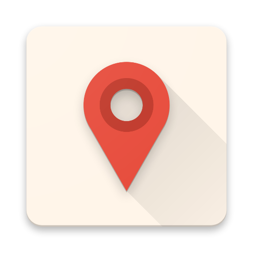

<h1>Plin</h1>

Manage your schedule on a map

 

## Requirements
Node 6.11.4

NPM 3.5.2

Android SDK 27 (Build Tools 27.0.3)

## Installation

```sh
git clone https://github.com/trickedoutdavid/Plin.git
```

```sh
cd Plin/Plin-RN
npm install
```

Edit Plin/Plin-RN/node_modules/react-native-calendar-events/android/build.gradle to match below:

```gradle
apply plugin: 'com.android.library'

android {
    compileSdkVersion 27
    buildToolsVersion '27.0.3'

    defaultConfig {
        minSdkVersion 19
        targetSdkVersion 27
        versionCode 1
        versionName "1.0"

    }
    lintOptions {
       warning 'InvalidPackage'
    }
}

dependencies {
    provided 'com.facebook.react:react-native:+'
}
```

## Build and Test

Debug: 
- Use Expo XDE to compile and run.

Release: 
- Replace publish url in Plin/Plin-RN/android/app/src/main/java/com/iter/schedmap/MainActivity.java with your own
```java
  @Override
  public String publishedUrl() {
    return "exp://exp.host/@trickedoutdavid/plin";  //replace here
  }
```
- Requires compile from Android Studio (Build -> Generate Signed APK) and Publish from XDE

